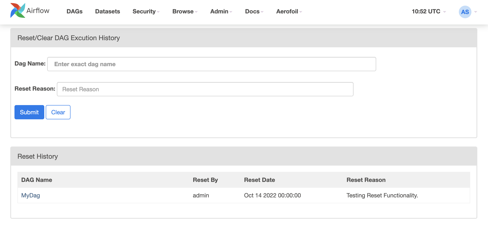

<figure>

<figcaption style="color: grey !important;"> 
	Aerofoil improving Airflow, to create a better airflift. 
</figcaption>
</figure>

I have been working on Airflow for quite some time now and on feature there were few features that I found desperately wanting in my installation without paying. When I looked at Airflow Product Backlog or Airflow Improvment Proposals (AIP) [log](https://cwiki.apache.org/confluence/display/AIRFLOW/Airflow+Improvement+Proposals), I didn't see these feature in any proirity and understandably so. There is so much to do in core Airflow and it is all very exciting. So I decided to create  a pluging that will contain features, that are not core to Airflow, but supports it and help improve the efficiency. 

Although  [poorly documented](https://airflow.apache.org/docs/apache-airflow/stable/plugins.html), Airflow has a farily good plugin Architecture. So the what does is [Aerofoil](https://github.com/anu2602/aerofoil) do? Well the name is reflection of vision for plugin. I am hoping that over next couple of year, it will have many side feature that doesn't make sense as part of Airflow Core but none the less provides multifild efficiency gains. The plugin is available with [MIT license](https://github.com/anu2602/aerofoil/blob/master/LICENSE.md), the intention is to keep it simple and friendly. 

#### Features

##### Aerofoil Menu
The first thing you will notice, provbably will be a new Aerofoil menu  in your Airflow UI. 

##### Backfill UI: 
A convenient way to run Backfill DAG from UI. In most of the enterprise setup, DAG developers do not have access to Airflow servers to be able to run backfill jobs. This makes running backfill an expensive operation. With the Backfilll UI, Airflow users can submit backfill command from UI. The backfill itself runs as a Airflow DAG and is compatible with most production Airflow configurations. This is also the most used feature in Aerofoil.

##### Reset DAG History
Sometime complete DAG history needs to be reset. There is currently no way of clearing a DAGs history in Airflow. This functionality allows clearing/resetting DAGs history via a convenient UI.  

##### Fake Sucess
A shortcut to mark your DAG/Task runs successful. The Fake success is a powerful featurs, and to avoid misuse and Audit Trail is maintained. Adminstratos can always find out, who is trying to fake it. 

##### My DAGs
Large Airflow installations can have hundreds of DAGs. This feature allows logged in user to view to see the DAG's authored by her/him. The DAG Author must be set correctly in the DAG file and it must match with the Airflow user name. 

##### AerofoilBashOperator: 
Context aware BashOperator, that can take a context and pass it to callback e.g. `on_success_callback`, `on_failure_callback` etc. 

## Contribute:
If you find something missing and would like to contrinute, feel free to raise a pull request. If you find a bug and would like me to fix it, please feel free to raise an issue. I look forward to work with some amazing contributors and learn from you. 

