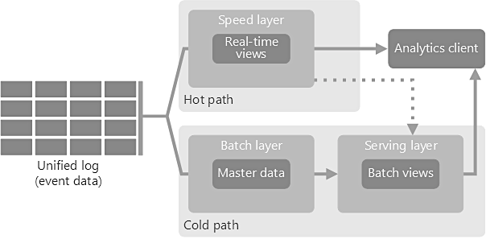
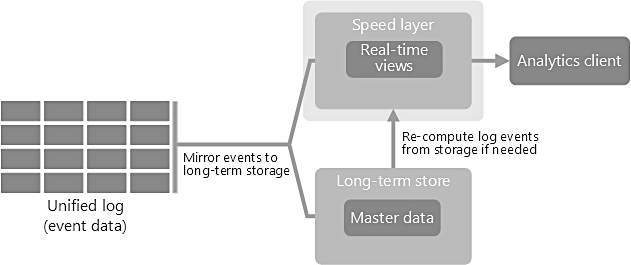

<figure>
	 
	<figcaption style="color: grey !important;"> 
		Photo by <a href="https://unsplash.com/@fabioha" style="color: grey !important;" target="_blank">Fabio</a> 
	</figcaption>
</figure>

Big data architecture is the foundation for big data analytics. The big data architecture framework serves as a reference blueprint for big data infrastructures and solutions, logically defining how big data solutions will work, the components that will be used, how information will flow, and security details. A goood big data system is designed to handle the ingestion, processing, and analysis of data that is too large or complex for traditional database systems. 

The size of Big Data realm differs for organizations. For some, it can mean hundreds of gigabytes of data, while for others it means hundreds of terabytes. Size of data, need for advance analytics capabilities, users and the budget are some of the key factors that affect the big data architecture.

# Four Stages
Big data architecture process is not different from any other system design at high level. However each stage the process differs and attention should be paied to the details.

### 1. Analyze the Problem: 
Understand data variety, velocity, and challenges with the current system. Common use cases include data archival, process offload, data lake implementation, unstructured data processing, and data warehouse modernization. Architecture team needs to work with many departments, stake-holders and vendor model the the problem, understand the budget. Of the three V's of Big Data System (volume, variety and velocity), velocity is most tricky to asses and model. Speed matters in business and big data velocity underpins the speed of business decisions.

### 2. Decide Deployment Strategy: 
Deployment can be either on-premises, which tends to be more secure; cloud-based, which is cost effective and provides flexibility regarding scalability; or a mix deployment strategy. If cloud based bring an agreement on the the provider AWS, Azure or GCP. The choice has some technical merits, but largerly decided by data governance, organization policies and IT Strategy. Clould based solutions work best for Big Data Solutions. Since most of the Big data systems have volatile resource requirment, autoscaling on cloud can result in big savings. 

### 3. Select Tooling: 
Hadoop is one of the most widely recognized big data architecture tools for managing big data end to end architecture. Select from variou various Hadoop distribution, Databricks, BigInsights, Cloudera. Next select various component, orchestration tools, visualization tools etc. The tooling is dependent on the Deployment strategy e.g tooling for GCP will be very different from tooling on AWS or Azure. 

### 4. Architecure, Design and Devops planning: 
When above 3 stages have completed, we have enough information to start on actual architecture and design for our Big Data System  This includes planning, pipeline design, CICD, data security, monitoring, autoscaling, disaster recovery, data governance etc. 

# Architectural Patterns
Unstructured data is the fastest growing type of data, some example could be imagery, sensors, telemetry, video, documents, log files, and email data files. There are several techniques to address this problem space of unstructured analytics. The techniques share a common characteristics of scale-out, elasticity and high availability. MapReduce, in conjunction with the Hadoop Distributed File System (HDFS) and HBase database, as part of the Apache Hadoop project is a modern approach to analyze unstructured data. Hadoop clusters are an effective means of processing massive volumes of data, and can be improved with the right architectural approach. There are three main architural patterns:

### Lambda architecture
<figure>
 
<figcaption style="color: grey !important;"> 
    Lambda Architecture
</figcaption>
</figure>
The name lambda architecture is derived from a functional processing paradime, data processing is funcation of all data. This architecture pattern provide balance between latency, throughput, and fault-tolerance by using batch processing and real-time stream processing simultaneously. Lambda architecture depends on a data model with an append-only, immutable data source that serves as a system of record. Three Layers of Lambda Architecture are 

#### Batch Layer
New data comes continuously, as a feed to the data system. It gets fed to the batch layer and the speed layer simultaneously. It looks at all the data at once and eventually corrects the data in the stream layer.  Here we can find lots of ETL and a traditional data warehouse. This layer is built using a predefined schedule, usually once or twice a day. The batch layer has two very important functions:
- To manage the master dataset
- To pre-compute the batch views.

#### Serving Layer
The outputs from the batch layer in the form of batch views and those coming from the speed layer in the form of near real-time views get forwarded to the serving.  This layer indexes the batch views so that they can be queried in low-latency on an ad-hoc basis.

#### Speed Layer (Stream Layer)
This layer handles the data that are not already delivered in the batch view due to the latency of the batch layer. In addition, it only deals with recent data in order to provide a complete view of the data to the user by creating real-time views.

#### Benefits of lambda architectures
Here are the main benefits of lambda architectures:
- No Server Management – you do not have to install, maintain, or administer any software.
- Flexible Scaling – your application can be either automatically scaled or scaled by the adjustment of its capacity
- Automated High Availability – refers to the fact that serverless applications have already built-in availability and faults tolerance. It represents a guarantee that all requests will get a response about whether they were successful or not.
- Business Agility – React in real-time to changing business/market scenarios

#### Challenges with lambda architectures
Lambda architectures can be highly complex.  The batch and streaming sides each require a different code base that must be maintained and kept in sync so that processed data produces the same result from both paths. Yet attempting to abstract the code bases into a single framework puts many of the specialized tools in the batch and real-time ecosystems out of reach.

### Kappa architecture
Kappa Architecture is a simplification of Lambda Architecture; it is Lambda architecture without batch processing. To replace batch processing, data is simply fed through the streaming system quickly. The main premise behind the Kappa Architecture is that you can perform both real-time and batch processing, especially for analytics, with a single codebase and infrastructure. If you need to recompute the entire data set (equivalent to what the batch layer does in lambda), you simply replay the stream. The data is ingested as a stream of events into a distributed and fault tolerant unified log. These events are ordered, and the current state of an event is changed only by a new event being appended. Similar to a lambda architecture's speed layer, all event processing is performed on the input stream and persisted as a real-time view.

<figure>
 
<figcaption style="color: grey !important;"> 
    Kappa Architecture
</figcaption>
</figure>

One downside of Kappa is the need to re-process events in the case of errors; however access to affordable, elastic compute makes

Use Cases

- When the processing applied to the real-time data and the historical data are same. 
- Data systems that are online learners and therefore don't need the batch layer.
- The order of the events and queries is not predetermined. Stream processing platforms can interact with the database at any time.

There are few other newer Big Data Architectures:
- Google Inspireed Zeta Architecture
- IOT Architecture (IoT-A)
- Mu Architecture
 

## References
- <https://en.wikipedia.org/wiki/Lambda_architecture>
- <https://docs.microsoft.com/en-us/azure/architecture/data-guide/big-data/>
- <https://eng.uber.com/kappa-architecture-data-stream-processing/>
- <https://www.oreilly.com/radar/questioning-the-lambda-architecture/>
- <http://radar.oreilly.com/2015/04/zeta-architecture-hexagon-is-the-new-circle.html>

