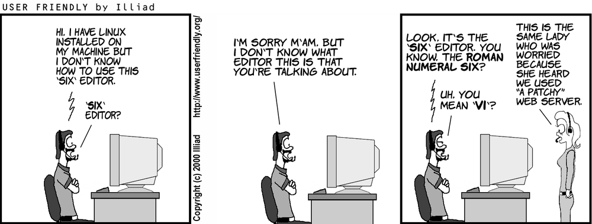

<figure>

<figcaption style="color: grey !important;"> 
        Webcomics by <a href="https://en.wikipedia.org/wiki/User_Friendly" style="color: grey !important;" target="_blank">J. D. Frazer</a> 
    </figcaption>
</figure>

The UNIX vi editor is a full screen editor and has two modes of operation:
- Command mode commands which cause action to be taken on the file, and
- Insert mode in which entered text is inserted into the file.

In the command mode, every character typed is a command that does something to the text file being edited; a character typed in the command mode may even cause the vi editor to enter the insert mode. In the insert mode, every character typed is added to the text in the file; pressing the <Esc> (Escape) key turns off the Insert mode.
While there are a number of vi commands, just a handful of these is usually sufficient for beginning vi users. To assist such users, this Web page contains a sampling of basic vi commands. The most basic and useful commands are marked with an asterisk (* or star) in the tables below. With practice, these commands should become automatic.

NOTE: Both UNIX and vi are case-sensitive. Be sure not to use a capital letter in place of a lowercase letter; the results will not be what you expect.


## Screen Manipulation
```
    ^f  move forward one screen
    ^b  move backward one screen
    ^d  move down (forward) one half screen
    ^u  move up (back) one half screen
    ^l  redraws the screen
    ^r  redraws the screen, removing deleted lines
```

## Insert/Append
```
    a Append after cursor
    i Insert before cursor
    o Open line below
    O Open line above
    :r file Insert file after current line
```


## Change(c)
n is number, optionl if changing one.  
```
    nr Change n characters
    ncw Change n words
    ncc Change n lines - blanks lines
    c$ Change to end of line
```


## Delete(d) 
n is number, optionl if deleting one.  
```
    nx Delete n characters
    ndw Delete n words
    ndd Delete n lines
    d$/D Delete to end of line
    db Delete previous word
    
```

## Undo 
```
    u Undo last change
    U Undo all changes on line
```

## Yanking 
```
    nyy  copy (yank, cut) the nex n lines (including current) into the buffer
    p   put (paste) the line(s) in the buffer into the text after the current line
    yw  Yank a word.
    y$  Yank to the end of the line.
```

## Movement : sentence and  paragraph  
```
    ( Move back one sentence.
    ) Move forward one sentence.
    { Move back one paragraph.
    } Move forward one paragraph.
```

## Search / Replace
```
     :[address]s/old_text/new_text/
```
In 11 lines starting with current line, repleace Banana with Mango.
```
    :.,.+10s/Banana/Mango
```
Search Backwards
```
    :?pattern
```
## RegEx
```
    . (dot) any single character except newline 
    * zero or more repeats
    [...] any character in set 
    [^ ...] any character not in set 
    ^ , $ beginning, end of line 
    \< , \> beginning, end of word
    \(. . . \) grouping 
    \n contents of n th grouping 
```

## RegEx Exmples
```
```

## Settings
```
    :set x Enable option x. 
    :set nox Disable option x. 
    :set x=val Give value to option x. 
    :set Show changed options. 
    :set all Show all options. 
    :set x? Show value of option x.
```
Some useful options:
- nu : line numbers 
- history=50 : set history to 50
- tabstop=4
- ignorecase

## More Config
```
    :colorscheme use tab for color scheme options
    :filetype on
    :syntax on
```

## Related Files
```
    ~/.exrc - config files for vi
    ~/.vimrc - config file for vim
```

## Reference
- <http://vimregex.com/>
- <https://github.com/amix/vimrc>
- <https://gist.github.com/simonista/8703722>

