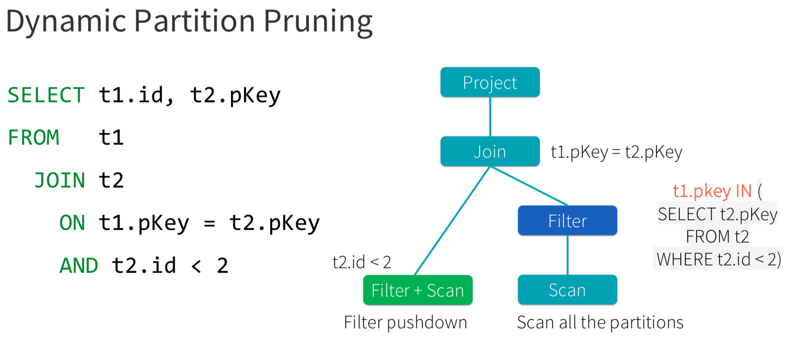

<figure>

</figure>

Okie, this is not really a cheatsheet. It is more about "what's new in Spark 3?", so more appropriate title would be "What's new in Spark3 Cheat Sheet". So Let's first look at what's new in Spark3. As with cheet sheet, we will only discuss most useful featurs, improvements that were introduced in Spark3:


# Performance 


#### 1. Adaptive Query Execution (AQE) [](https://issues.apache.org/jira/browse/SPARK-31412){:target="_blank"}
By far, this has to be the number one reason to upgrade to Spark3. Every spark developer was so looking forward to AQE improvement and they surely do not disappoint. Prior to 3.0, Spark optimized by creating an execution plan before the query execution, AQE applies a second level of optimization based on the metrics it sees with each stage.

In Spark 3.0, the AQE framework is result of 40+ Improvements, three main ones are:
- **Dynamically coalescing shuffle partitions** simplifies the number of shuffle partitions. 
- **Dynamically switching join strategies** partially avoids executing suboptimal plans due to missing statistics and/or size misestimation.
- **Dynamically optimizing skew joins** can parallelize skew processing and achieve better overall performance.

Adaptive Query Execution is disabled by default. Adaptive Query Execution is used if query meets the following criteria:
- It is not a streaming query
- It contains at least one exchange (usually when there’s a join, aggregate or window operator) or one subquery

> In order to enable AQE, set `spark.sql.adaptive.enabled` configuration property to `true`. 

After enabling Adaptive Query Execution, Spark performs 2x improvement on TPC-DS over Spark 2. There’s no need to “know” your data in advance any more. AQE will figure out the data and improve the query plan as the query runs, increasing query performance for faster analytics and system performance.

#### 2. Dynamic Partition Pruning 
Basically, dynamic partition pruning is to avoid partition scanning based on the queried results of the other query fragments. It is important for star schema queries. Spark3 implements dynamic partition pruning by adding a dynamic-partition-pruning filter if there is a partitioned table and a filter on the dimension table. The filter is then planned using a heuristic approach:
- As a broadcast relation if it is a broadcast hash join. The broadcast relation will then be transformed into a reused broadcast exchange by the ReuseExchange rule; or
- As a subquery duplicate if the estimated benefit of partition table scan being saved is greater than the estimated cost of the extra scan of the duplicated subquery; otherwise
- As a bypassed condition (true).
 Below shows a .
<figure>
 
<figcaption style="color: grey !important;"> 
    A basic example of DPP
</figcaption>
</figure>

# New Features

#### 3. New Structured Streaming
A new Structured Streaming tab to has been added to Spark UI to monitor Structured streaming applications. This tab provides the run ID, Status, Start Time, Duration for each micro-batch along with runtime statistics. This helps the developer to debug and understand what’s happening with the streaming queries. It has two sections.
- Active Streaming Queries
- Completed Streaming Queries
<figure>
 
<figcaption style="color: grey !important;"> 
    Structured Streaming UI
</figcaption>
</figure>


#### 4. Accelerator-aware Scheduler (Project Hydrogen)
GPUs and other accelerators have been widely used for accelerating special workloads, e.g., deep learning and signal processing. While users from the AI community use GPUs heavily, they often need Apache Spark to load and process large datasets and to handle complex data scenarios like streaming. Spark is not aware of GPUs and hence cannot properly request and schedule them for users. This leaves a critical gap to unify big data and AI workloads and make life simpler for end users.
<figure>
 
<figcaption style="color: grey !important;"> 
    Accelerating Apache Spark 3.0 with GPUs and RAPIDS
</figcaption>
</figure>

<figure>
 
<figcaption style="color: grey !important;"> 
    n Spark 2.x, separate clusters were needed for ETL on CPUs, and model training on GPUs.
</figcaption>
</figure>

<figure>
 
<figcaption style="color: grey !important;"> 
    In Apache Spark 3.0, you can now have a single pipeline, from data ingest to data preparation to model training on a GPU powered cluster.
</figcaption>
</figure>

#### 4. Other notable Features

##### 4.1 Datasource to Read Binary Files
```
    val df = spark.read.format("binaryFile").load("/tmp/binary/spark.png")
```
##### 4.2 Feature to Read Recursive folders
```
    spark.read.option("recursiveFileLookup", "true").csv("/path/to/folder")
```

##### 4.3 Multiple Character Delimiter Support
 For example, to read a CSV file with the following content.
```
    col1||col2||col3||col4
    val1||val2||val3||val4
    val1||val2||val3||val4
```
below code can be used.
```
    val df  = spark.read
      .option("delimiter","||")
      .option("header","true")
      .csv("/tmp/data/douplepipedata.csv")
```

##### 4.4 DataFrame.tail() feature 
```
    val data=spark.range(1,100).toDF("num").tail(5)
```

##### 4.4 DataFrame.tail() feature 
```
    val data=spark.range(1,100).toDF("num").tail(5)
```

### 4.5 New built-in functions
- sinh, cosh, tanh, asinh, acosh, atanh [](https://issues.apache.org/jira/browse/SPARK-28133){:target="_blank"}
- any, every, some [](https://issues.apache.org/jira/browse/SPARK-19851){:target="_blank"}
- bit_and, bit_or [](https://issues.apache.org/jira/browse/SPARK-27879){:target="_blank"}
- bit_count [](https://issues.apache.org/jira/browse/SPARK-29491){:target="_blank"}
- bit_xor [](https://issues.apache.org/jira/browse/SPARK-29545){:target="_blank"}
- bool_and, bool_or [](https://issues.apache.org/jira/browse/SPARK-30184){:target="_blank"}
- count_if [](https://issues.apache.org/jira/browse/SPARK-27425){:target="_blank"}
- date_part [](https://issues.apache.org/jira/browse/SPARK-28690){:target="_blank"}
- extract [](https://issues.apache.org/jira/browse/SPARK-23903){:target="_blank"}
- forall [](https://issues.apache.org/jira/browse/SPARK-27905){:target="_blank"}
- from_csv [](https://issues.apache.org/jira/browse/SPARK-25393){:target="_blank"}
- make_date [](https://issues.apache.org/jira/browse/SPARK-28432){:target="_blank"}
- make_interval [](https://issues.apache.org/jira/browse/SPARK-29393){:target="_blank"}
- make_timestamp [](https://issues.apache.org/jira/browse/SPARK-28495){:target="_blank"}
- map_entries [](https://issues.apache.org/jira/browse/SPARK-23935){:target="_blank"}
- map_filter [](https://issues.apache.org/jira/browse/SPARK-23937){:target="_blank"}
- map_zip_with [](https://issues.apache.org/jira/browse/SPARK-23938){:target="_blank"}
- max_by, min_by [](https://issues.apache.org/jira/browse/SPARK-27653){:target="_blank"}
- schema_of_csv [](https://issues.apache.org/jira/browse/SPARK-25672){:target="_blank"}
- to_csv [](https://issues.apache.org/jira/browse/SPARK-25683){:target="_blank"}
- transform_keys [](https://issues.apache.org/jira/browse/SPARK-23939){:target="_blank"}
- transform_values [](https://issues.apache.org/jira/browse/SPARK-23940){:target="_blank"}
- typeof [](https://issues.apache.org/jira/browse/SPARK-29961){:target="_blank"}
- version [](https://issues.apache.org/jira/browse/SPARK-29554){:target="_blank"}
- xxhash64 [](https://issues.apache.org/jira/browse/SPARK-27099){:target="_blank"}

#### 5. Catalog plugin API
This will bring multi-catalog support to Spark and allow external catalog implementations. In Spark 3 multiple catalogs can be added:
```
    spark.sql.catalog.catalog1=...
    spark.sql.catalog.catalog1.type=...
    spark.sql.catalog.catalog1.warehouse=...
    spark.sql.catalog.catalog2=...
    spark.sql.catalog.catalog2.type=...
    spark.sql.catalog.catalog2.warehouse=...
```

and can be used in query:
```
    spark.sql("SELECT * FROM catalog1.db1.table1")
```

# Upgrades and Enhancements

#### 6. Improvements on pandas UDF API
Pandas UDFs (User-Defined Functions) are probably one of the most significant Pandsa improvement added to Spark since version 2.3 as they allow users to leverage pandas API. The newest release of Apache Spark introduced a new interface of Pandas UDFs with Python type hints. Example:
```
    import pandas as pd
    from pyspark.sql.functions import pandas_udf

    @pandas_udf('long')
    def pandas_subtract_unit(s: pd.Series) -> pd.Series:
        return s - 1
```

#### 7. Switch to Proleptic Gregorian calendar 
Earlier version of Spark supports Dates in Julian and Gregorian calendar: For dates before 1582, the Julian calendar was used, for dates, after 1582 the Gregorian calendar was used. This is similar to Dates in JDK 7 and before which uses java.sql.Date API. From JDK 8, a new Proleptic Gregorian calendar has been introduced with java.time.LocalDate API.

#### 8. Better ANSI SQL compatible [](https://spark.apache.org/docs/3.0.0/sql-ref-ansi-compliance.html){:target="_blank"}
Since Spark 3.0, Spark SQL introduces two experimental options to comply with the SQL standard: `spark.sql.ansi.enabled` and `spark.sql.storeAssignmentPolicy`.

When `spark.sql.ansi.enabled` is set to true, Spark SQL follows the standard in basic behaviours (e.g., arithmetic operations, type conversion, SQL functions and SQL parsing). Moreover, Spark SQL has an independent option to control implicit casting behaviours when inserting rows in a table. The casting behaviours are defined as store assignment rules in the standard.

When `spark.sql.storeAssignmentPolicy` is set to ANSI, Spark SQL complies with the ANSI store assignment rules. This is a separate configuration because its default value is ANSI, while the configuration spark.sql.ansi.enabled is disabled by default.

#### 9.  Upgrades
- Hadoop 3 Upgrade
- JDK 11 Support
- Python3 
- Scala 2.12 
- Kfka 2.4.1  


If you still think this is not a cheat sheet, here is one of [my favorite Spark 3 Cheat Sheet](http://datacamp-community-prod.s3.amazonaws.com/acfa4325-1d43-4542-8ce4-bea2d287db10){:target="_blank"}. 


### Reference
1. [ Spark 3.0.3 Release Changelog ](https://spark.apache.org/releases/spark-release-3-0-0.html){:target="_blank"}
2. [ Adaptive Query Execution ](https://issues.apache.org/jira/browse/SPARK-31412){:target="_blank"}
3. [ Databricks Spark 3.0 blog ](https://databricks.com/blog/2020/06/18/introducing-apache-spark-3-0-now-available-in-databricks-runtime-7-0.html){:target="_blank"}
4. [ Dynamic Partition Pruning ](https://issues.apache.org/jira/browse/SPARK-11150){:target="_blank"}
5. [ Structured Streaming Tab ](https://spark.apache.org/docs/3.0.0/web-ui.html#structured-streaming-tab){:target="_blank"}
6. [ SPIP: Accelerator-aware task scheduling for Spark ](https://issues.apache.org/jira/browse/SPARK-24615){:target="_blank"}
7. [ Deep Dive into GPU Support ](https://databricks.com/session_na20/deep-dive-into-gpu-support-in-apache-spark-3-x){:target="_blank"}
8. [ Accelerating Apache Spark 3.0 with GPUs and RAPIDS ](https://developer.nvidia.com/blog/accelerating-apache-spark-3-0-with-gpus-and-rapids/){:target="_blank"}
9. [Spark API for Table Metadata](https://docs.google.com/document/d/1zLFiA1VuaWeVxeTDXNg8bL6GP3BVoOZBkewFtEnjEoo/edit#){:target="_blank"}
10. [ Catalog Plugin APi by example](https://books.japila.pl/spark-sql-internals/new-and-noteworthy/catalog-plugin-api-and-multi-catalog-support/){:target="_blank"}
11. [ Spark3 SQL Migration Guide](https://spark.apache.org/docs/latest/sql-migration-guide.html){:target="_blank"}
12. [ Revisiting Pandas UDF](https://docs.google.com/document/d/1-kV0FS_LF2zvaRh_GhkV32Uqksm_Sq8SvnBBmRyxm30/edit){:target="_blank"}
13. [Better ANSI SQL compatibality in Spark 3](https://spark.apache.org/docs/3.0.0/sql-ref-ansi-compliance.html){:target="_blank"}
