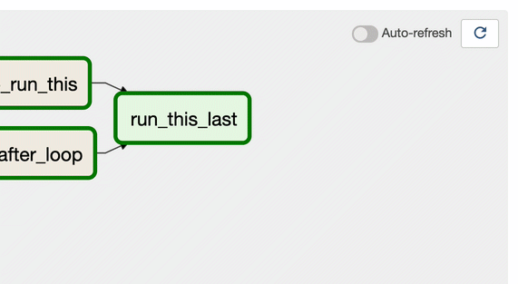

<figure>
 
<figcaption style="color: grey !important;"> 
	Photo by <a href="https://unsplash.com/@priscilladupreez" style="color: grey !important;" target="_blank">Priscilla Du Preez
</a> 
</figcaption>
</figure>

So [Airflow 2.0](https://airflow.apache.org/blog/airflow-two-point-oh-is-here/){:target="_blank"} is finally out, this was probably most anticipated release of Airflow mainly due to major refactoring around scheduler. 

> This is a major release. Since Airflow follows strict Semantic Versioning approach to release process, this implies major release such as 2.0, 3.0 will have backwards-incompatible changes. So this relase won't be simple upgrade, it  will require  some planning, changes to your DAGs and comprehensive testing.
 
### Should I care to update?
As expected and planned Airflow 2.0 has many other big ticket changes many of them are major code refactoring. Moreover Airflow Team is encouraging users to upgrade by suggesting 1.x release will be supported only for a limited period of time and and only "Critical Fixes" will be backported to 1.10.x. But featurs not fear should be your guide to upgarde. Let's have a quick look at new features in 2.0

##### Scheduler Overhaul: 
Airflow Scheduler was bottleneck for scalability and worryingly the only ‘single point of failure’ in airflow architecture. It was neither horizontally scalable nor highly avilable. Scheduler hacks and bugs in my opinion were most hated and dreaded in airflow community. The refactoring of scheduler was [long due](https://cwiki.apache.org/confluence/pages/viewpage.action?pageId=103092651){:target="_blank"}.  With Airflow 2.0 not only many scheduler bugs have been fixed and it has been made highly available, but also the performance of single scheduler has been increased manifold. You can run multiple scheduler in active-active HA model, which is huge from performance and scalability perspective. 

##### Stateless Webserver: 
Airflow 2.0 mandates stateless webserver. In Airflow 1.x both Webservers and Scheduler parse and proces the DAGs. Webserver Gunicorn process each maintain it's own DAG Bag, which can lead to inconsistant state. Webserver requiring to parse DAG files not only causes performance problems but also a deployment headaches as you are required to keep code in sync on multiple webserver nodes. With implementation of [AIP-24](https://cwiki.apache.org/confluence/display/AIRFLOW/AIP-24+DAG+Persistence+in+DB+using+JSON+for+Airflow+Webserver+and+%28optional%29+Scheduler){:target="_blank"} DAG Serialization has been mandated, which mean Schedulers will parse the DAGs and searialize them in metadata database, webservers will load the DAG medatadata from the metadata DB.

##### Task Groups: 
Prior to Airflow 2.0 SubDAGs were commonly used for grouping tasks in the UI, using SubDagOperator. However  SubDagOperator launches a completely different DAG and then monitors it as a separate entity. This can lead to all sorts of edge case, bugs and maintenance nightmares. With implementation of [AIP-34](https://cwiki.apache.org/confluence/display/AIRFLOW/AIP-34+TaskGroup%3A+A+UI+task+grouping+concept+as+an+alternative+to+SubDagOperator){:target="_blank"}, Airflow 2.0 introduces Task Groups as a method for organizing tasks which provides the same grouping behaviour as a subdag without any of the execution-time drawbacks. Here is an example of Task group

	
	with TaskGroup("my_task_group") as my_task_group:
	    task1 = DummyOperator(task_id="my_task_1")
	    task2 = DummyOperator(task_id="my_task_2")

	other_task = DummyOperator(task_id="other_task")
	my_task_group >> other_task
	

##### Smart Sensors:
Most of the data pipelines make heavy use of sensors; sensors execution takes up a significant proportion of Airflow cluster even with “reschedule” mode. To improve this [AIP-17](https://cwiki.apache.org/confluence/display/AIRFLOW/AIP-17%3A+Consolidate+and+de-duplicate+sensor+tasks+in+airflow+Smart+Sensor){:target="_blank"} is implemented to add a new mode in Airflow called “Smart Sensors”. The smart sensor is a service (run by a builtin DAG) which greatly reduces airflow’s infrastructure cost by consolidating some of the airflow long running light weight tasks. Instead of using one process for each task, the main idea of the smart sensor service is to improve the efficiency of these long running tasks by using centralized processes to execute those tasks in batches. The smart sensor service is supported in a new mode called “smart sensor mode”. 

##### Task Flow API:
 With implemenation of [AIP-31](https://cwiki.apache.org/confluence/pages/viewpage.action?pageId=148638736){:target="_blank"} DAGs are now much much nicer to code especially when using PythonOperator. This functional API will make DAGs writing significantly easier by abstracting the task and dependency management layer from users. Also to be noted `xcom_backend` parameter that will allow users to pass even various objects such as S3 and HDFS. Below is a quick sample, refer to [airflow documentation](https://airflow.apache.org/docs/apache-airflow/stable/concepts.html#taskflow-api){:target="_blank"} for more details.
	 
	from airflow.decorators import dag, task
	from airflow.utils.dates import days_ago

	@dag(default_args={'owner': 'anuradha'}, schedule_interval=None, start_date=days_ago(7))
	def test_etl():
	   @task
	   def test_extract():
	       return {"count": 10000, "frequency": 161, "age": 99}

	   @task
	   def transform(data: dict) -> dict:
	       return {"transformed_value": 1.618}

	   @task()
	   def load(ratio: float):
	       print("Golden Ratio is {ratio:.2f}")

	   e = extract()
	   t = transform(order_data)
	   load(t[transformed_value])

	my_etl_dag = test_etl()

	

##### Simplified Kubernetes Executor
Airflow 2.0  includes re-architecture of the Kubernetes Executor and KubernetesPodOperator. You will now be able to access the full Kubernetes API to create a .yaml [pod_template_file](https://airflow.apache.org/docs/apache-airflow/stable/executor/kubernetes.html?highlight=pod_override#pod-template-file){:target="_blank"} instead of specifying parameters in their airflow.cfg.

##### Fully specified REST API
Airflow now has a fully supported (no-longer-experimental, YaY!) API with a comprehensive OpenAPI specification.
You can find more details about API [here](http://airflow.apache.org/docs/apache-airflow/stable/stable-rest-api-ref.html){:target="_blank"}.

##### UI/UX Improvements
 Airflow release notes claimed that UI has been given a visual refresh and updated some of the styling. Only refreshing feature I find in this UI refresh is "Auto Refresh", pun intended.    

### What is breaking?

As mentioned ealier, this release has breaking changes, here is list (not comprehensive) of backwards-incompatible changes.

- No support for Python 2, Airflow 2 works only with Python 3. Airflow 2.0.0 requires Python 3.6+ and has been tested with Python versions 3.6, 3.7 and 3.8, but does not yet support Python 3.9.
- FAB UI no longer supported, weather you like it or not you will have to use RBAC UI. If you are using custom Airflow Plugins and were passing admin_views & menu_links which were used in the non-RBAC UI (flask-admin based UI), you will have to update it to use flask_appbuilder_views and flask_appbuilder_menu_links.
- Airflow 2.0 is not a monolithic “one to rule them all” package. Airflow has been split into core and 61 (for now) provider packages. Each provider package is for either a particular external service e.g PostgreSQL, MySQL, HTTP, FTP etc. You will have to not only install the pacakges but also update your DAGs to refer to correct provider package.
- CLI options have been re-organized so that related commands are grouped together. If you have support team, processes and documentation, it will need updating.
-  Connection type list in the Airflow UI is based on the providers you have installed with Airflow 2.0. So again make sure to install provider package, even if you were only using it to define a connection type.
- Jinja templete would break with use of ndefined variables instead of silently ignoring. You can override this behavior, but requires changes.
- Airflow metadata upgrade is not trivial to rollback, if you had to rollback.
- MariaDB and MySQL5 are not supported due to HA Scheduler requiring support for SKIP LOCKED or NOWAIT SQL clauses. 

### How difficult is it to upgrade? 

I would say fairly complex, it would need planning if you are runnig a serious production data pipelines with Airflow. You get an idea of the complexity by lookig at [Airflow 2.0 Upgrade Guide](https://airflow.apache.org/docs/apache-airflow/stable/upgrading-to-2.html#frequently-asked-questions-on-upgrade){:target="_blank"}.  

The upgrade itself is a  mulit-step process, you first need to upgrade to bridge release (1.10.14), Modify all your DAGs to ensure compatibility, update configuration settings, migrate metadata DB and upgrade Airflow to 2.0. 

> Many users have reported issues on upgrade specially around metadata migration and providers. Many users have reported issues during upgrade and many have reported issues after upgrade. I would recommend doing a through planning and testing in non-production environment before upgrading production. 

### Should I Upgrade?
Short answer is **Yes**, but it is more complex than that. If you have pressing priorities on your data delivery, you shold handle them first. Aifrlow 2.0 will not produce any new magical results for you. 

If you are starting now or in initial stages of buidling your data pipelines with Airflow, I would highly recommend that you start using Airflow 2.0 now.

Airflow documentation clearly says:  *"Airflow 1.10.x release tree will be supported for a limited time after the GA release of Airflow 2.0 to give users time to upgrade from one of the Airflow 1.10.x releases. Specifically, only "critical fixes" defined as fixes to bugs that take down Production systems, will be backported to 1.10.x core for six months after Airflow 2.0.0 is released."*
 
So you should start preparing/planning for upgrade as soon as possible. Plan for upgrade to take advantage of new features not just for sake of it. I would personally wait for release 2.1 for actual upgrade but start to plan for the upgrade today. 

# Reference
- [Airflow 2.0 Release Announcement](https://airflow.apache.org/blog/airflow-two-point-oh-is-here/){:target="_blank"}
- [Airflow 2.0 Release tag on Github](https://github.com/apache/airflow/releases/tag/2.0.0){:target="_blank"}
- [Airflow 2.0 Release Ticket](https://github.com/apache/airflow/issues/10152){:target="_blank"}
- [Airflow 2.0 Rlease Planning Confluence Page](https://cwiki.apache.org/confluence/display/AIRFLOW/Airflow+2.0+-+Planning){:target="_blank"}
- [TaskFlow API documentation](https://airflow.apache.org/docs/apache-airflow/stable/tutorial_taskflow_api.html){:target="_blank"}
- [Scheduler documentation](https://airflow.apache.org/docs/apache-airflow/2.0.0/scheduler.html){:target="_blank"}
- [Airflow 2.0 Concepts](https://airflow.apache.org/docs/apache-airflow/stable/concepts.html){:target="_blank"}
- [Airflow 2.0 Rlease Announcement on Astronomer](https://www.astronomer.io/blog/airflow-2-scheduler){:target="_blank"}	

